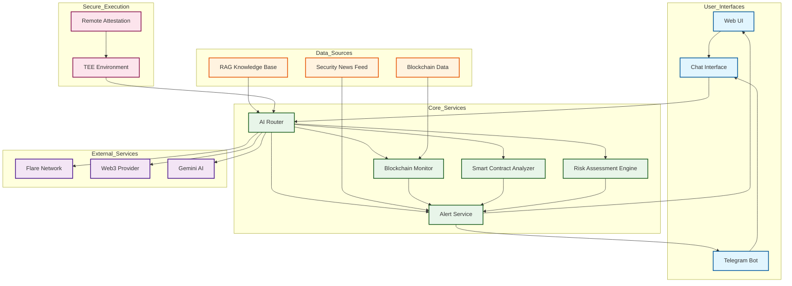

# FlareSense: AI-Powered DeFi Security Platform

DeFAI agent that improves DeFi security by detecting risks, suggesting fixes, and sending live alerts. It uses real-time security data, blockchain monitoring, RAG, and consensus learning to keep users and protocols safe.

## System Architecture



TEE External IP: http://34.169.170.179/
GCP instance name: flare-sense

Demo URL: https://flare-sense.up.railway.app
Docker Image: docker.io/jayshreeanand/flare-sense

## Key Features

- **Smart Contract Security Analysis**  
  Analyze smart contracts for vulnerabilities, code quality issues, and gas optimization opportunities. Get detailed reports with severity ratings, specific vulnerability locations, and actionable recommendations for fixes.

- **AI-Powered Risk Assessment**  
  Evaluate the security posture of smart contracts, protocols, and blockchain addresses using advanced AI models with RAG knowledge and consensus learning. Receive comprehensive risk scores and detailed explanations of potential threats.

- **Real-time Blockchain Monitoring**  
  Monitor blockchain activity, track whale movements, detect unusual transactions, and receive security alerts in real-time. Set up custom monitoring for specific addresses and protocols of interest.

- **Security News & Vulnerability Alerts**  
  Stay informed about the latest security incidents, vulnerabilities, and threats in the DeFi ecosystem. Receive timely notifications about issues that could affect your monitored assets.

- **Telegram Bot Integration**  
  Subscribe to real-time security alerts via Telegram, query contract risk scores, monitor addresses and protocols, and get the latest DeFi security news directly through the Telegram bot.

- **Unified Chat Interface**  
  Interact with all FlareSense features through a conversational AI interface. Analyze contracts, set up monitoring, manage Telegram alerts, and more using natural language commands.

- **Secure AI Execution**  
  All operations run within a Trusted Execution Environment (TEE) featuring remote attestation support for robust security and privacy protection.

- **Flare Blockchain Integration**  
  Seamlessly interact with the Flare blockchain, perform token operations, and generate secure wallets from within the TEE.


## Screenshots


## Getting Started

You can deploy FlareSense using Docker (recommended) or set up the backend and frontend manually.

### Environment Setup

1. **Prepare the Environment File:**  
   Rename `.env.example` to `.env` and update the variables accordingly.
   > **Tip:** Set `SIMULATE_ATTESTATION=true` for local testing.

### Build using Docker (Recommended)

The Docker setup mimics a TEE environment and includes an Nginx server for routing, while Supervisor manages both the backend and frontend services in a single container.

1. **Build the Docker Image:**

   ```bash
   docker build -t flare-ai-defai .
   ```

2. **Run the Docker Container:**

   ```bash
   docker run -p 80:80 -it --env-file .env flare-ai-defai
   ```

3. **Access the Frontend:**  
   Open your browser and navigate to [http://localhost:80](http://localhost:80) to interact with the Chat UI.

## Build Manually

Flare AI DeFAI is composed of a Python-based backend and a JavaScript frontend. Follow these steps for manual setup:

#### Backend Setup

1. **Install Dependencies:**  
   Use [uv](https://docs.astral.sh/uv/getting-started/installation/) to install backend dependencies:

   ```bash
   uv sync --all-extras
   ```

2. **Start the Backend:**  
   The backend runs by default on `0.0.0.0:8080`:

   ```bash
   uv run start-backend
   ```

#### Frontend Setup

1. **Install Dependencies:**  
   In the `chat-ui/` directory, install the required packages using [npm](https://nodejs.org/en/download):

   ```bash
   cd chat-ui/
   npm install
   npm install recharts --legacy-peer-deps  # For data visualization components
   ```

2. **Configure the Frontend:**  
   Update the backend URL in `chat-ui/src/App.js` for testing:

   ```js
   const BACKEND_ROUTE = "http://localhost:8080/api/routes/chat/";
   ```

   > **Note:** Remember to change `BACKEND_ROUTE` back to `'api/routes/chat/'` after testing.

3. **Start the Frontend:**

   ```bash
   npm start
   ```

## Telegram Bot Integration

FlareSense includes a Telegram bot for real-time security alerts and blockchain monitoring.

### Setup

1. **Create a Telegram Bot:**

   - Message [@BotFather](https://t.me/BotFather) on Telegram
   - Use the `/newbot` command to create a new bot
   - Follow the instructions to set a name and username
   - Copy the API token provided by BotFather

2. **Configure Environment Variables:**

   - Add the following to your `.env` file:
     ```
     TELEGRAM_BOT_TOKEN=your_bot_token_here
     ENABLE_TELEGRAM_BOT=true
     ```

3. **Start the Application:**
   - The Telegram bot will automatically start when the application is launched
   - Send `/start` to your bot on Telegram to begin

### Bot Commands

- `/start` - Get started with the bot
- `/subscribe` - Subscribe to alerts
- `/unsubscribe` - Unsubscribe from alerts
- `/monitor_protocol <protocol>` - Monitor a specific protocol
- `/monitor_address <address>` - Monitor a specific blockchain address
- `/risk <contract_address>` - Get risk assessment for a contract
- `/news` - Get the latest DeFi security news
- `/help` - Show available commands

### API Endpoints

The following API endpoints are available for managing Telegram bot subscriptions:

- `POST /api/routes/monitoring/telegram/subscribe` - Subscribe to alerts
- `POST /api/routes/monitoring/telegram/unsubscribe` - Unsubscribe from alerts
- `POST /api/routes/monitoring/telegram/monitor/protocol` - Monitor a protocol
- `POST /api/routes/monitoring/telegram/monitor/address` - Monitor an address

## Common Errors and Solutions

### Import Error: Cannot import name 'ChatRouter' from 'flare_ai_defai.api'

If you encounter this error when starting the backend:

```
ImportError: cannot import name 'ChatRouter' from 'flare_ai_defai.api' (/app/src/flare_ai_defai/api/__init__.py)
```

This is caused by a missing export in the API module. To fix it:

1. Edit the file `/src/flare_ai_defai/api/__init__.py`:

```python
"""
API Module

This module provides API routes for the Flare AI Agent.
"""

from fastapi import APIRouter
from flare_ai_defai.api.routes.chat import ChatRouter
from flare_ai_defai.api.contract_routes import router as contract_router
from flare_ai_defai.api.monitoring_routes import router as monitoring_router
from flare_ai_defai.api.risk_assessment_routes import router as risk_assessment_router

# Create a combined router
router = APIRouter()
router.include_router(contract_router)
router.include_router(monitoring_router)
router.include_router(risk_assessment_router)

__all__ = [
    "ChatRouter",
    "contract_router",
    "monitoring_router",
    "risk_assessment_router",
    "router"
]
```

This ensures that both `ChatRouter` and `router` are properly exported from the API module.

### Blockchain Monitoring Error: POA Chain

If you see errors like:

```
Error in blockchain monitoring error="The field extraData is 80 bytes, but should be 32. It is quite likely that you are connected to a POA chain."
```

This is because the Web3 library needs to be configured with the proper middleware for Proof of Authority chains like Flare. This is a known issue and doesn't affect the core functionality of the application.

## 📁 Repo Structure

```plaintext
src/flare_ai_defai/
├── ai/                     # AI Provider implementations
│   ├── base.py            # Base AI provider interface
│   ├── gemini.py          # Google Gemini integration
│   └── openrouter.py      # OpenRouter integration
├── api/                    # API layer
│   ├── middleware/        # Request/response middleware
│   └── routes/           # API endpoint definitions
├── attestation/           # TEE attestation
│   ├── vtpm_attestation.py   # vTPM client
│   └── vtpm_validation.py    # Token validation
├── blockchain/              # Blockchain operations
│   ├── explorer.py        # Chain explorer client
│   └── flare.py          # Flare network provider
├── monitoring/              # Monitoring services
│   ├── alert_service.py     # Alert management
│   ├── blockchain_monitor.py # Blockchain activity monitoring
│   ├── news_monitor.py      # Security news monitoring
│   └── telegram_bot.py      # Telegram bot integration
├── prompts/              # AI system prompts & templates
│    ├── library.py        # Prompt module library
│    ├── schemas.py        # Schema definitions
│    ├── service.py        # Prompt service module
│    └── templates.py       # Prompt templates
├── exceptions.py      # Custom errors
├── main.py          # Primary entrypoint
└── settings.py       # Configuration settings error

chat-ui/
├── src/
│   ├── components/        # React components
│   │   ├── ContractAnalysis.js  # Smart contract analysis component
│   │   ├── RiskAssessment.js    # Risk assessment component
│   │   └── MonitoringDashboard.js  # Blockchain monitoring component
│   ├── App.js            # Main application component
│   └── ...               # Other React files
└── ...                   # Configuration files
```

## Deploy on TEE

Deploy on a [Confidential Space](https://cloud.google.com/confidential-computing/confidential-space/docs/confidential-space-overview) using AMD SEV.

### Prerequisites

- **Google Cloud Platform Account:**  
  Access to the [`verifiable-ai-hackathon`](https://console.cloud.google.com/welcome?project=verifiable-ai-hackathon) project is required.

- **Gemini API Key:**  
  Ensure your [Gemini API key](https://aistudio.google.com/app/apikey) is linked to the project.

- **gcloud CLI:**  
  Install and authenticate the [gcloud CLI](https://cloud.google.com/sdk/docs/install).

### Environment Configuration

1. **Set Environment Variables:**  
   Update your `.env` file with:

   ```bash
   TEE_IMAGE_REFERENCE=ghcr.io/flare-foundation/flare-ai-defai:main  # Replace with your repo build image
   INSTANCE_NAME=<PROJECT_NAME-TEAM_NAME>
   ```

2. **Load Environment Variables:**

   ```bash
   source .env
   ```

   > **Reminder:** Run the above command in every new shell session or after modifying `.env`. On Windows, we recommend using [git BASH](https://gitforwindows.org) to access commands like `source`.

3. **Verify the Setup:**

   ```bash
   echo $TEE_IMAGE_REFERENCE # Expected output: Your repo build image
   ```

### Deploying to Confidential Space

Run the following command:

```bash
gcloud compute instances create $INSTANCE_NAME \
  --project=verifiable-ai-hackathon \
  --zone=us-west1-b \
  --machine-type=n2d-standard-2 \
  --network-interface=network-tier=PREMIUM,nic-type=GVNIC,stack-type=IPV4_ONLY,subnet=default \
  --metadata=tee-image-reference=$TEE_IMAGE_REFERENCE,\
tee-container-log-redirect=true,\
tee-env-GEMINI_API_KEY=$GEMINI_API_KEY,\
tee-env-GEMINI_MODEL=$GEMINI_MODEL,\
tee-env-WEB3_PROVIDER_URL=$WEB3_PROVIDER_URL,\
tee-env-SIMULATE_ATTESTATION=false \
  --maintenance-policy=MIGRATE \
  --provisioning-model=STANDARD \
  --service-account=confidential-sa@verifiable-ai-hackathon.iam.gserviceaccount.com \
  --scopes=https://www.googleapis.com/auth/cloud-platform \
  --min-cpu-platform="AMD Milan" \
  --tags=flare-ai,http-server,https-server \
  --create-disk=auto-delete=yes,\
boot=yes,\
device-name=$INSTANCE_NAME,\
image=projects/confidential-space-images/global/images/confidential-space-debug-250100,\
mode=rw,\
size=11,\
type=pd-standard \
  --shielded-secure-boot \
  --shielded-vtpm \
  --shielded-integrity-monitoring \
  --reservation-affinity=any \
  --confidential-compute-type=SEV
```

#### Post-deployment

1. After deployment, you should see an output similar to:

   ```plaintext
   NAME          ZONE           MACHINE_TYPE    PREEMPTIBLE  INTERNAL_IP  EXTERNAL_IP    STATUS
   defai-team1   us-central1-c  n2d-standard-2               10.128.0.18  34.41.127.200  RUNNING
   ```

2. It may take a few minutes for Confidential Space to complete startup checks. You can monitor progress via the [GCP Console](https://console.cloud.google.com/welcome?project=verifiable-ai-hackathon) logs.
   Click on **Compute Engine** → **VM Instances** (in the sidebar) → **Select your instance** → **Serial port 1 (console)**.

   When you see a message like:

   ```plaintext
   INFO:     Uvicorn running on http://0.0.0.0:8080 (Press CTRL+C to quit)
   ```

   the container is ready. Navigate to the external IP of the instance (visible in the **VM Instances** page) to access the Chat UI.

### 🔧 Troubleshooting

If you encounter issues, follow these steps:

1. **Check Logs:**

   ```bash
   gcloud compute instances get-serial-port-output $INSTANCE_NAME --project=verifiable-ai-hackathon
   ```

2. **Verify API Key(s):**  
   Ensure that all API Keys are set correctly (e.g. `GEMINI_API_KEY`).

3. **Check Firewall Settings:**  
   Confirm that your instance is publicly accessible on port `80`.

4. **Frontend Dependencies:**  
   If charts or visualizations aren't rendering properly, ensure recharts is installed:
   ```bash
   cd chat-ui/
   npm install recharts --legacy-peer-deps
   ```

## 💡 Next Steps

Once your instance is running, access the Chat UI using its public IP address. Here are some example interactions to try:

- **"Create an account for me"**
- **"Transfer 10 C2FLR to 0x000000000000000000000000000000000000dEaD"**
- **"Show me your remote attestation"**
- **"Analyze this smart contract for vulnerabilities"**
- **"Assess the risk of this protocol"**
- **"Monitor this blockchain address for suspicious activity"**

### Future Upgrades

- **TLS Communication:**  
  Implement RA-TLS for encrypted communication.

- **Expanded Flare Ecosystem Support:**
  - **Token Swaps:** via [SparkDEX](http://sparkdex.ai)

### Example Use Cases & Project Ideas

Below are several detailed project ideas demonstrating how the template can be used to build autonomous AI agents for Flare's DeFi ecosystem:

#### NLP interface for Flare ecosystem

Implement a natural language command parser that translates user intent into specific protocol actions, e.g.:

```plaintext
"Swap 100 FLR to USDC and deposit as collateral on Kinetic" →
{
  action: ["swap", "deposit"],
  protocols: ["SparkDEX", "Kinetic"],
  amounts: [100],
  tokens: ["FLR", "USDC"]
}
```

- Add cross-protocol optimization features:

  - Automatic route splitting across DEXs for better prices
  - Gas optimization by batching multiple transactions
  - Yield optimization by comparing lending rates across protocols

- Automated token swaps and integrations with Flare ecosystem applications:
  - [SparkDEX](http://sparkdex.ai/): Token swaps + Perpetual futures
  - [Kinetic](http://kinetic.market/): Borrow-lend protocol
  - [RainDEX](http://rainlang.xyz): Trading strategies
  - [Cycle](https://cyclo.finance): Liquidation-free leverage

### RAG Knowledge

Connect the DeFAI agent with the RAG from [`flare-ai-rag`](https://github.com/flare-foundation/flare-ai-rag) trained on datasets such as:

- [Flare Developer Hub](https://dev.flare.network)
- [Flare Website](https://flare.network)
- [Flare X](https://x.com/FlareNetworks)

### Transaction simulation

Use a transaction simulation framework such as [Tenderly Simulator](https://tenderly.co/transaction-simulator) to show users the expected outcome of their transaction.
